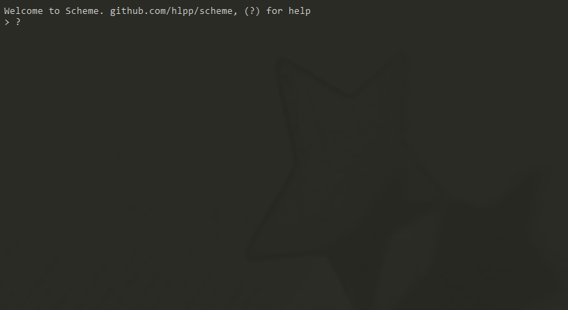
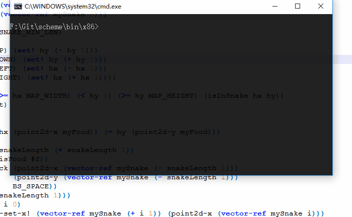

# scheme

Scheme编程语言的解释器。  

## 特性
目前的支持:
* 变量引用: `<variable>`
* 局部变量: `let`
* 常量引用: `quote`,`'`  
* 过程调用: `(operator operand ...)`
* 过程: `lambda`  
* 第一级函数  
* 静态(词法)作用域
* 闭包
* 动态类型
* 传值调用
* 条件表达式: `if`,`when`,`unless`,`and`,`or`,`cond`,`case`
* 递归
* 尾递归
* 顺序结构: `begin`
* 迭代结构: `let`,`do`,`while`,`for`
* 定义: `define`
* 赋值: `set!`

* 标准过程
    + 相等谓词  
        `eq?`,`equal?`
    + 数值运算和数值输入/输出  
        `number?`,`=`,`<`,`<`,`>`,`<=`,`>=`,`+`,`*`,`-`,`/`,  
        `zero?`,`positive?`,`negative?`,`odd?`,`even?`,`abs`,`remainder`,`modulo`
       1. 整数: `integer?`
       2. 实数: `real?`
    + 布尔  
        `boolean?`,`not`
    + 序对和表  
        `pair?`,`null?`,`list?`,`cons`,`car`,`cdr`,`set-car!`,`set-cdr!`,  
        `caar`,`cadr` `...` `cdddar`,`cddddr` (`car`和`cdr`的组合,默认定义到第四层),  
        `list`,`length`,`memq`,`memv`,`member`,`list-tail`,`list-ref`,`append`,`reverse`
    + 符号  
        `symbol?`
    + 字符  
        `char?`,`char=?`,`char<?`,`char>?`,`char<=?`,`char>=?`,  
        `char-ci=?`,`char-ci<?`,`char-ci>?`,`char-ci<=?`,`char-ci>=?`,  
        `char-alphabetic?`,`char-numeric?`,`char-whitespace?`,`char-upper-case?`,`char-lower-case?`,  
        `char->integer`,`integer->char`,  
        `char-upcase`,`char-downcase`
    + 字符串    
        `string?`,`make-string`,`string`,`string-length`,`string-ref`,`string-set!`,`substring`,`string-append`,  
        `string->list`,`list->string`,`string-copy`,`string-fill!`
    + 向量  
        `vector?`,`make-vector`,`vector`,`vector-set!`,`vector-ref`,`vector-length`,  
        `vector->list`,`list->vector`,`vector-fill!`
    + 控制特征  
        `procedure?`,`apply`,`void`,`void?`
    + 求值  
        `eval`
    + 输入/输出  
        `read`,`write`,`newline`,`display`
    + 系统接口  
        `load`,`time`,`clock`,`rand`,`?`,`exit`,`set`
* 注释  
  单行注释: `; ...`  

* 扩展
    + 中括号`[]`, 大括号`{}`  
    + 多行注释: `#| ... |#`  
    + Win32控制台控制 例子见[/tests/pcc32/](tests/pcc32/)

    
## 用法
运行`scheme`会开始并给你一个REPL(Read-Eval-Print-Loop)环境。  
调用`load`加载执行源文件:  
`(load "file1.scm")`  
执行源文件:  
`scheme file1.scm file2.scm`  
`--e`选项接收一个代码字符串以执行:  
`scheme --e "(define x 1) (+ x 2)"`  

## 截图
  

